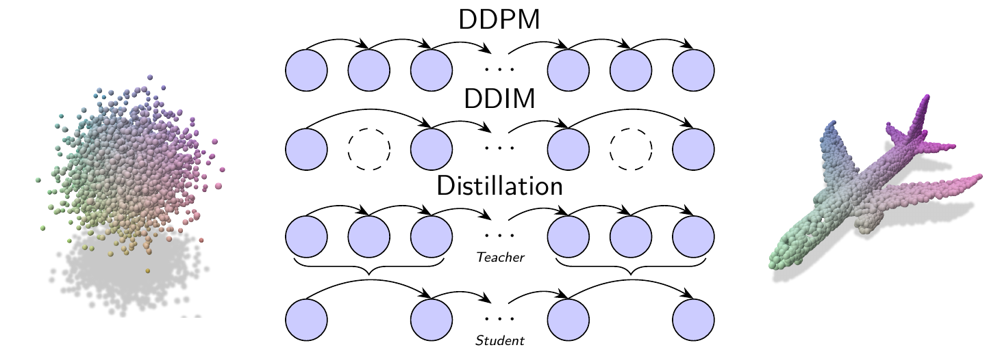
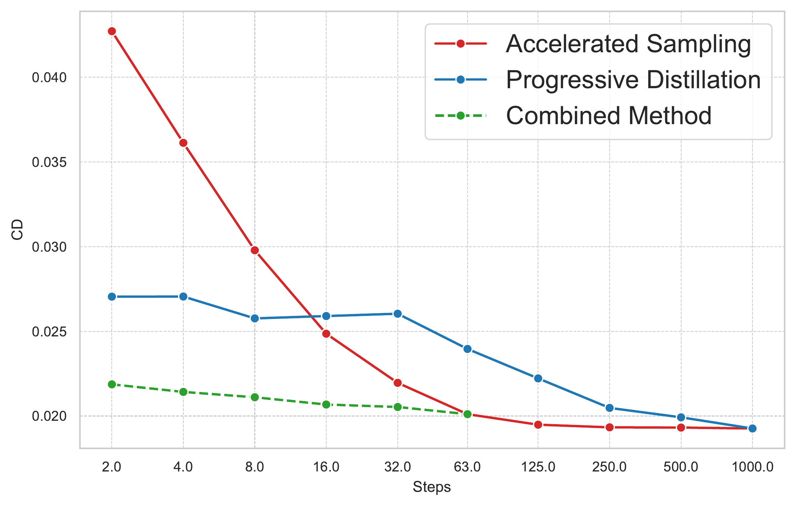
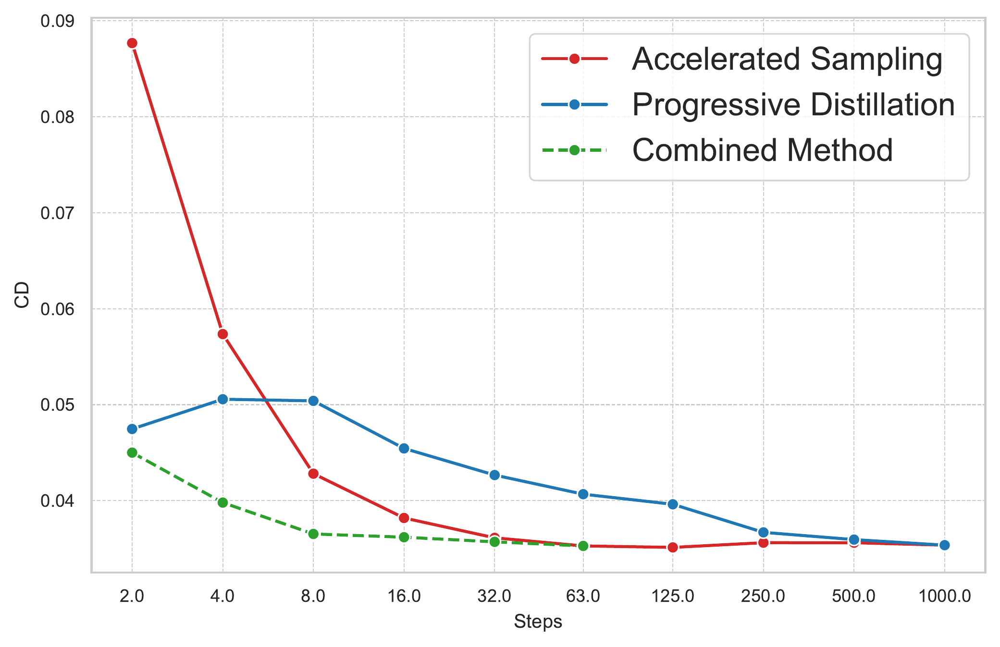
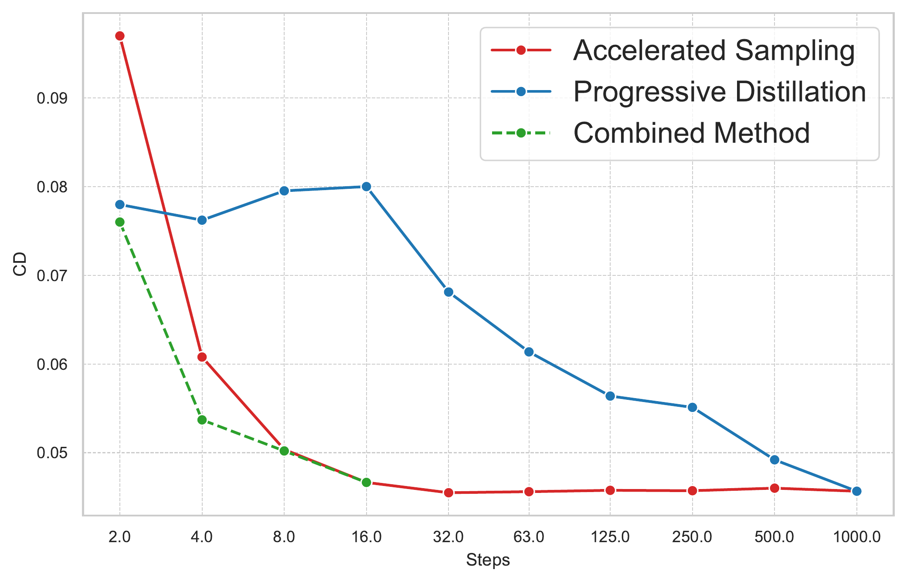
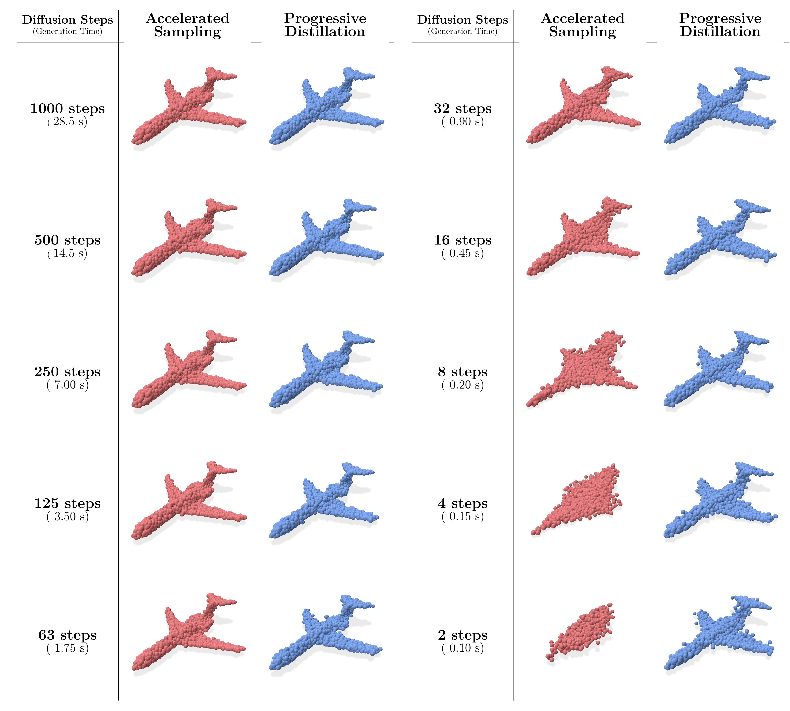
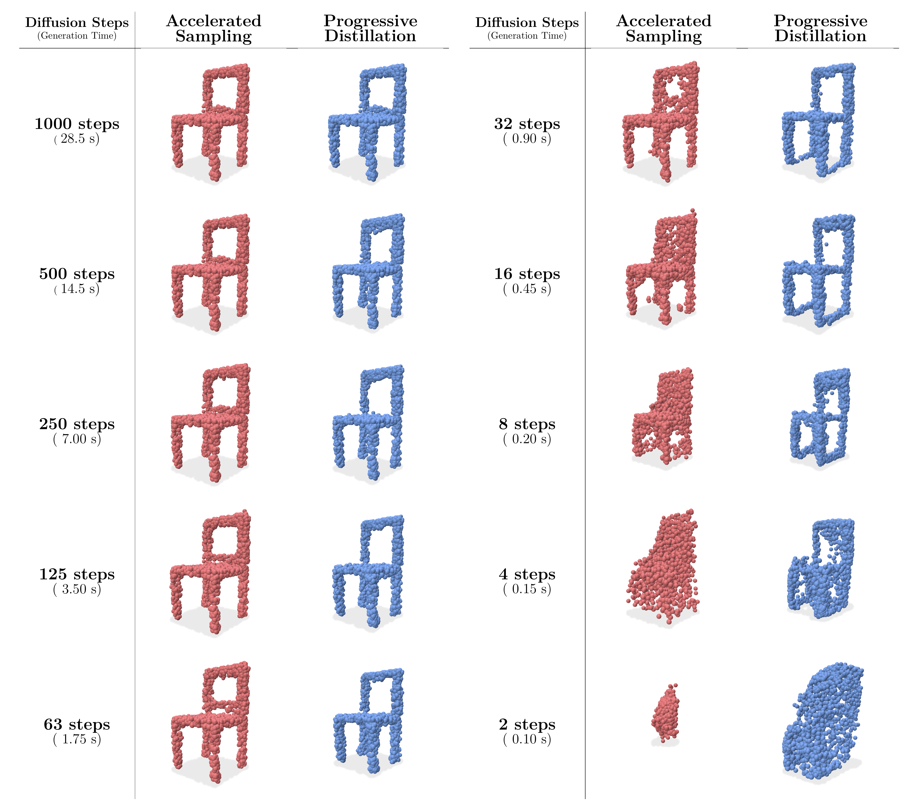

# Accelerating diffusion models for image-conditioned point cloud generation

This repository contains the code for my **Diploma Thesis** titled *"Accelerating diffusion models for image-conditioned point cloud generation"* at the University of Patras. It is available [here](https://nemertes.library.upatras.gr/items/2841344e-d186-4e22-8dc9-92d214340c4d)

The thesis explores the use of diffusion models for generating 3D point clouds from 2D images, focusing on optimizing the inference speed of pre-trained diffusion models while maintaining high-quality outputs.

## Results

With the proposed methods we were able to achieve significant speed-ups in inference time while maintaining competitive quality in the generated point clouds.

### Evolution of Chamfer distance for different total steps

  
  
  

### Visual examples

  
  
  

## Installation

Much of the project was adapted from the [SPVD_Lightning](https://github.com/JohnRomanelis/SPVD_Lightning/) repository. Please refer to their instructions for setting up the environment. An `environment.yml` file is also provided for creating a conda environment with the necessary dependencies.

## Citation

This thesis is currently being adapted for publication. Citations will be provided once available.